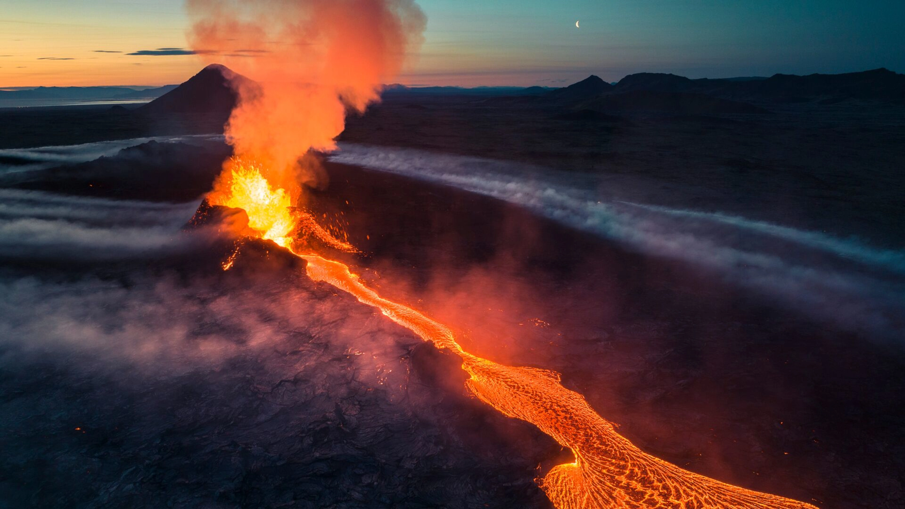

 

### Motivation

Recently, a striking news about the volcano eruption in Iceland caught our attention. Motivated by the need to better understand and analyze the impact of such natural phenomena, we aim to delve into the patterns, trends, and factors surrounding volcanic eruptions, utilizing data science techniques to extract meaningful insights.

### Screencast

